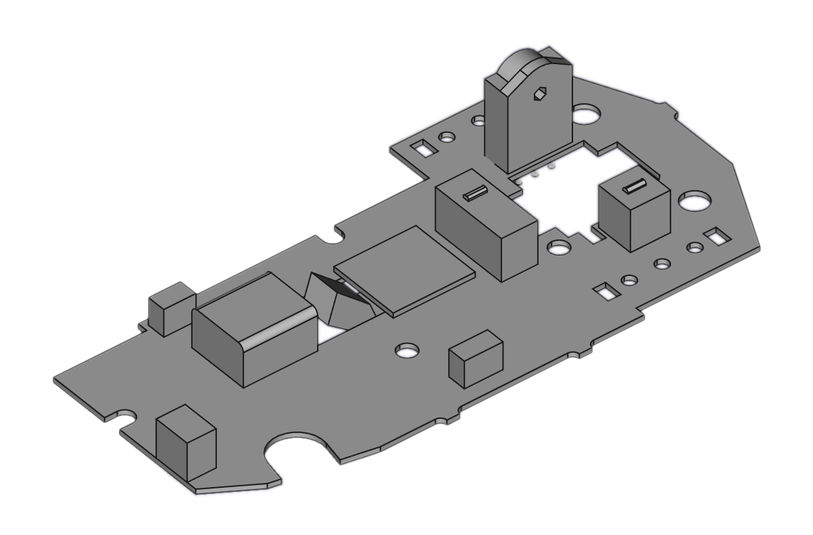

# g305-re


Reverse engineering of the [G305](https://www.logitechg.com/en-us/products/gaming-mice/g305-lightspeed-wireless-gaming-mouse.910-005280.html) mouse by [Logitech](https://www.logitech.com/en-us)

### Specs

| Spec | Range | Unit |
|:--|--:|:-:|
| DPI | 200 - 12000 | - |
| Max acceleration | 40 | g |
| Max Tracking speed | 400 | I/s |
| Report Rate | 1 | kHz |
| Processor Core | 32-bit ARM | - |
| Claimed Battery Life | 250 | hours |

#### Eletrical Characteristics


| Characteristic | Range | Unit |
|:--|--:|:-:|
| Active Power | 10 | mW |
| Idle Power * | 4 | mW |
| Deep Sleep Power ** | 200 | uW |
| Turn On Voltage *** | 1.35 | V |
| Max Voltage **** | 2.0 | V |

```
     * No movement
    ** After approximately 90 seconds idle 
   *** Below this voltage the device is consistently unable to start
  **** The device can tolerate more (tested up to 5.5V), 
but above 4.8V it seems to consume unusually high power during Deep Sleep, 
and above 2.0V the sensor voltage bus follows the input voltage (the same appens with the main 3.3V bus) meaning it goes over 
the rated opperating conditions (assumed 2.1V given ratings of similar sensor).
```
`These are rough conservative approximations (though measured with fairly good equipment). Measurements on a single personal device.`

#### Expected Battery Life

| Battery | Weight [g] | Nominal Voltage [V] | Capacity [mAh] | Capacity [mWh] | Active Battery Life [h] |
|:--|--:|--:|--:|--:|--:|
| ALkaline LR6 (AA) | | 1.5 | 1800 – 2850 | 2700 - 4275 | 270 - 428 |
| ALkaline LR03 (AAA) | | 1.5 | 860 – 1200 | 1290 - 1800 | 129 - 180 |
| Lithium 14500 (AA) | | 3.6 | 600 - 840 (1600 @ 1.5V) | 2160 - 3024 (2400 @ 1.5V) | 216 - 302 |
| Lithium 10440 (AAA) | | 3.6 | 350 | 1260 | 126 |
| PR675 | 1.85 | 1.4 | 550 - 600 | 770 - 840 | 77 - 84 |
| Super Capacitor 70F | 18 | 2.7 | - | - | 5.83 |
| Super Capacitor 30F | 6.9 - 9.7 | 2.7 | - | - | 2.5 |

[source](https://en.wikipedia.org/wiki/AAA_battery), [source](https://en.wikipedia.org/wiki/AA_battery)

### hardware

The hardware was traced in gimp, and can be analyzed in there too (everything is layered), file is [here](trace/g305.xcf).
`Whatch out, the top is mirrored!`


#### Mechanical

CAD drawings of the G305 available in [cad](cad/)


credit to [inornate](https://www.thingiverse.com/inornate) on thingiverse.

#### Components

The main board consists of:

 - The HERO sensor
 - A NRF52810 MCU in QFN-48
 - unidentified boost converter 1
 - unidentified boost converter 2
 - 3x unidentified mosfet
 - unidentified common anode RGB LED
 - chip antenna
 - 16MHz crystal?

#### testpoints

The PCB contains the following testpoints:

testpoint | Funcion | Additional Info
:---: | :---: | :---:
TP1 | VIN + | Direct from battery 1.5V
TP2 | VIN - | Direct from battery 
TP3 |  | Does not Exist? 
TP4 |  | Does not Exist?
TP5 |  | Does not Exist?
TP6 | P0.04 | Unused Pin Breakout
TP7 |  | Does not Exist?
TP8 |  | Does not Exist?
TP9 |  | Does not Exist?
TP10 | GND | 
TP11 | VDD | 
TP12 | SWDIO | 
TP13 | SWCLK | 
TP14 | RESET | 
TP15 | P0.22 | SWO?
TP16 | P0.08 | Unused Pin Breakout
TP17 | P0.09 | Unused Pin Breakout
TP18 | P0.10 | Unused Pin Breakout
TP19 | P0.29 | Unused Pin Breakout
TP20 | P0.30 | Unused Pin Breakout
TP21 | P0.31 | Unused Pin Breakout
TP22 | P0.27 | Unused Pin Breakout
TP23 | P0.28 | Unused Pin Breakout

#### MCU connections

Pin name | Function
:---: | :---:
P0.11 | CS
P0.12 | MOSI
P0.13 | MISO
P0.14 | SCLK
~ | ~
P0.15 | LMB
P0.16 | RMB
P0.17 | MMB
P0.18 | side button
P0.19 | side button
P0.20 | dpi button
~ | ~
P0.23 | encoder pull up resistors (power saving)
P0.00 | wheel encoder
P0.01 | wheel encoder
~ | ~
P0.02 | used as analog input to 2V??
P0.03 | used as analog input to 3.7V section??
~ | ~
P0.05 | rgb
P0.06 | rgb
P0.07 | rgb

`guess on P0.02/P0.03: one or both of them is used to monitor battery voltage`

### firmware

[to be dumped](https://limitedresults.com/2020/06/nrf52-debug-resurrection-approtect-bypass/)

### Sensor

The G305 comes with a HERO sensor, made by (I believe) [Pixart](https://www.pixart.com/index/).

A reverse engineering effort towards this sensor wwill be made in a separate repo [hero-re](https://github.com/perigoso/hero-re).

